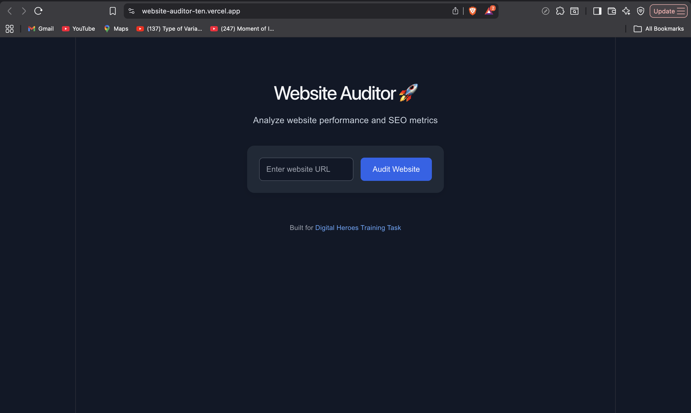
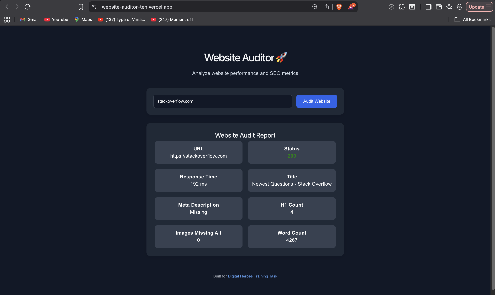

# 🌐 Website Auditor

A full-stack web application built with React and Spring Boot that analyzes websites and generates a basic SEO and accessibility report.

## 🚀 Live Demo

- **Frontend:** https://website-auditor-ten.vercel.app
- **Backend API:** https://website-auditor-production-36bc.up.railway.app

---

##Screenshots

## Home Page




### Audit Report



---

## ✨ Features

- Audit any public website
- Automatic URL normalization (`google.com` → `https://google.com`)
- HTTP Status Code
- Response Time
- Page Title
- Meta Description
- H1 Tag Count
- Images Missing Alt Attributes
- Word Count
- Automatic HTTPS URL normalization
- Loading Indicator
- Error Handling
- Responsive UI

---

## 🛠️ Tech Stack

### Frontend

- React
- Vite
- Axios
- CSS

### Backend

- Java 21
- Spring Boot
- Maven
- Jsoup

### Deployment

- Frontend: Vercel
- Backend: Railway

---

## 📂 Project Structure

```
website-auditor/
│
├── backend/
│   ├── src/
│   ├── pom.xml
│
├── frontend/
│   ├── src/
│   ├── package.json
│
└── README.md
```

---

## ⚙️ Running Locally

### Clone the repository

```bash
git clone https://github.com/AkhilChauhan2211/website-auditor.git
```

---

### Backend

```bash
cd backend
./mvnw spring-boot:run
```

Runs on:

```
http://localhost:8080
```

---

### Frontend

```bash
cd frontend
npm install
npm run dev
```

Runs on:

```
http://localhost:5173
```

---

## 📡 API Endpoint

### POST

```
/api/audit
```

### Request

```json
{
  "url": "https://google.com"
}
```

### Response

```json
{
  "url": "https://google.com",
  "status": 200,
  "responseTimeMs": 603,
  "title": "Google",
  "metaDescription": "...",
  "h1Count": 0,
  "imagesWithoutAlt": 0,
  "wordCount": 29
}
```

---

## 💡 Challenges Faced

During development, I encountered and resolved several real-world issues including:

- Spring Boot configuration
- Lombok annotation processing
- Maven dependency issues
- Git repository restructuring
- CORS configuration between Railway and Vercel
- Backend deployment
- Frontend deployment
- API integration and debugging

These helped me better understand full-stack application development and deployment.

---

## 🔮 Future Improvements

If I had more time, I would add:

- Overall SEO Score
- Accessibility Score
- Lighthouse Integration
- Open Graph Tag Analysis
- Robots.txt Detection
- Sitemap Detection
- Page Speed Insights
- Audit History
- Export Report as PDF
- Dark Mode

---

## 👨‍💻 Author

**Akhil Chauhan**

GitHub:
https://github.com/AkhilChauhan2211

LinkedIn:
https://www.linkedin.com/in/akhil-chauhan-68a275281/

---

## Notes

This project was developed as part of the Digital Heroes Full Stack Developer Assessment.
